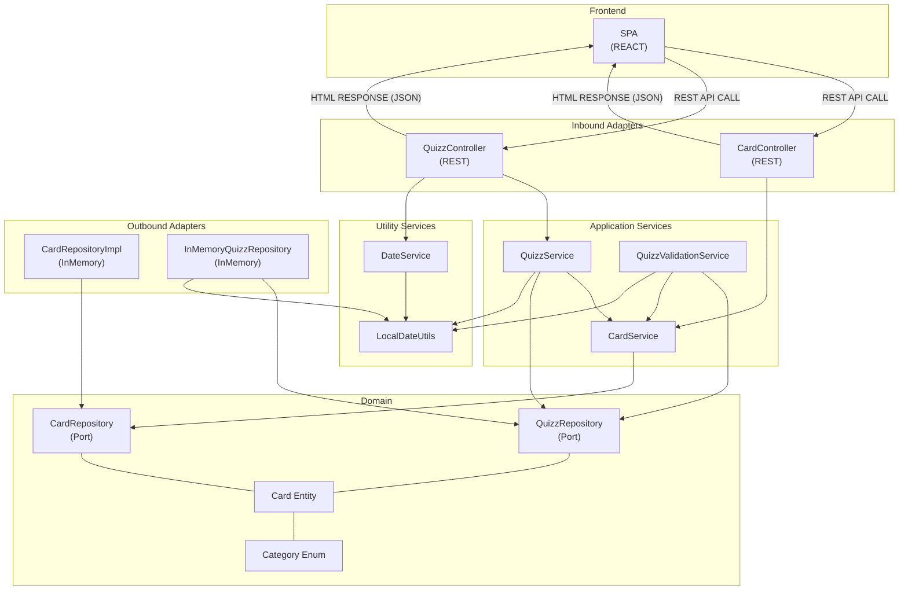

# Welcome to our Clean Code project called Anki-Remastered

#### This project is made with NestJS, is designed with a Hexagonal Architecture and developed with a Clean Code approach / TDD. 

# NEST API

### To get started

 After you cloned the project in your local files, you can go in the api folder with `cd anki-remastered-api`

### Prepare the database

- `cp .env.exemple .env` to rename the .env.example file to .env and modify it

[//]: # (docker will be needed if database logic is implemented)
[//]: # (- `docker-compose up -d `to start the database)

### Then you will need to fetch all dependencies needed to run the api, for that you can run
`npm ci` that will fetch dependencies in the `package-lock.json`file

```bash
  npm run build
```
This command will build the project and create a `dist` folder where you can find the compiled code

### To launch project in development mode

```bash
  npm run start:dev
```
else
```bash
    npm run start
```

## Testing

#### All tests are in the `test` folder

To run the tests you can run the command:

```bash
  npm run test
```

or if you want to have the coverage with it too

```bash
  npm run test:cov
```


### To run api / http / e2e tests

You can use the IntelliJ HTTP Client to run the tests in the `test/http` folder <br>
You can also use the docker image provided by JetBrains to run the tests in the `test/http` folder <br>
But you will need to have the docker image installed on your machine

After you have started the api with `npm run start:dev` you can run the command:

```bash
docker run --rm -v ./test/http:/workdir jetbrains/intellij-http-client -D test-suite.http
```

## Documentation

The documentation is generated with Swagger, you can access it by going to `http://localhost:3000/api` when the server is running

## Architecture

The architecture of the project is based on the Hexagonal Architecture.
### To visualize the architecture, you can use the following mermaid diagram, install the extension in your IDE or use the online editor: https://mermaid-js.github.io/mermaid-live-editor/



## Authors

### - Loriane HILDERAL

### - Clarence HIRSCH

### - Nino PLANE
